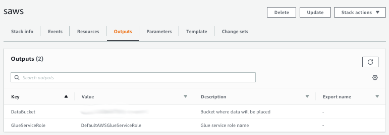

## Setup

In this section we are going to use a CloudFormation template to perform the following actions:  

* Create a destination bucket in your account where the dataset will be placed. We will refer to this bucket as `<workshop-bucket>` through the rest of the instructions.
* Copy the dataset over from the workshop source location to the destination  `<workshop-bucket>`. 
* Create the IAM role that grants AWS Glue permissions to work with the dataset

1. Click the **Launch Stack** link below for the region of your choice.

	Region| Code | Launch
	------|------|-------
	EU (Ireland) | eu-west-1 | 

1. Click **Next** on the *Select Template* page.

1. On the *Specify Details* page, leave all the defaults and click **Next**.

1. On the Options page, also leave all the defaults and click **Next**.

1. On the Review page, check the boxes to acknowledge that CloudFormation will create IAM resources and click **Create Change Set**.

	
    
 
1. Wait for the change set to finish computing changes and click **Execute**

	

1. Wait for the `saws` stack to reach a status of `CREATE_COMPLETE` (you might need to click the refresh button to see the stack being created). 

1. Click on the **Outputs** tab. Review the artifacts created: 
	* An S3 bucket that holds the dataset: `<workshop-bucket>`
	* An IAM role for AWS Glue: `DefaultAWSGlueServiceRole`

	

### Congratulations! You completed the setup

[Back to home page](README.md)

