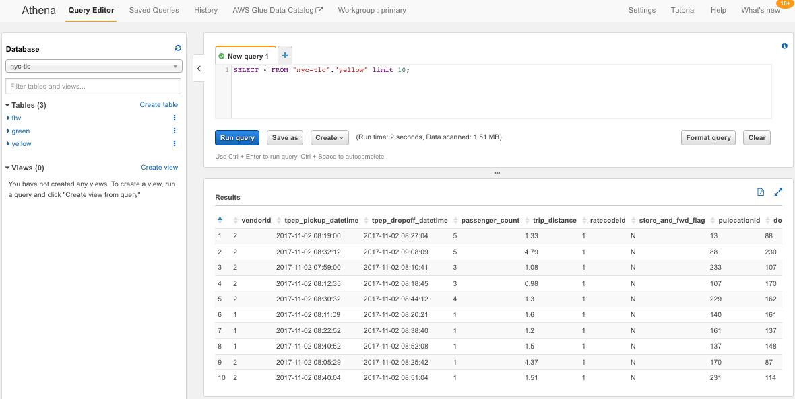
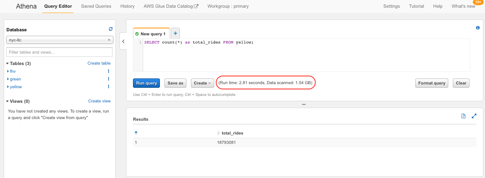
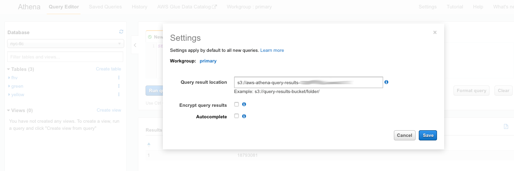
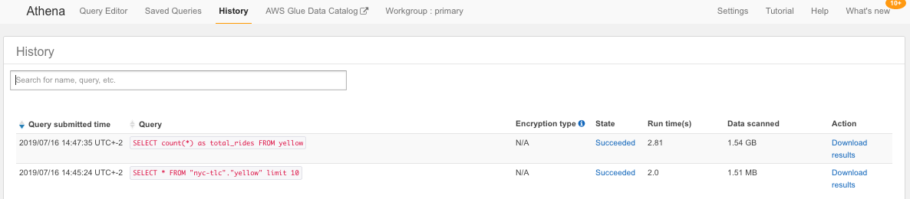

## Data discovery and exploration

Once AWS Glue classified your data, the catalog is immediately searchable, queryable, and available for ETL. 
In this step we will leverage [Amazon Athena](https://aws.amazon.com/athena/) to browse through the catalog on Amazon S3 using standard SQL. Amazon Athena is based on standards and uses Apache Presto under the covers. Being serverless, there is no cluster infrastructure to manage, and you pay only for the queries that you run.

1. Still on the [AWS Glue management console](https://console.aws.amazon.com/glue/home), click on **Tables**. Select the `yellow` table by clicking the checkbox on the left. Click the **Action** drop-down list and select **View data**

	
	
	If/when the Preview data pop-up dialog window shows up, just click **Preview data**

2. That will take you to the [Amazon Athena query editor](https://console.aws.amazon.com/athena/home). If you see a welcome page click **Get started**. Let's start with a very simple SQL query in it: 

	```sql
	SELECT * FROM "nyc-tlc"."yellow" limit 10;
	```
	The Athena query editor has three sections: the catalog navigator, the query pane and the results pane.
	On the catalog navigator, you can select from the **database** drop-down list the default database for Athena queries. Once you select a database, the catalog below is updated to show the list of tables available in that database
	
	Below the query pane you will find useful information regarding how long it took to execute the query and how much data it scanned.

	

3. On the query pane, enter the query below and run it.

	```sql
	SELECT count(*) as total_rides FROM yellow;
	```

	Notice that we are not adding the database qualifier `nyc-tlc`. Athena just uses the default database selected.
	Take note of the time it takes now to run the query and the data it scans. 

	

4. The results of Athena queries can be downloaded directly from the results pane by clicking the  icon, without re-executing the query. To make that possible Amazon Athena stores the results of each query on an S3 bucket that you can specify by clicking on **Settings**

	
	
	You can accept the defaults or replace them with a bucket/prefix of your preference. If you change them just make sure the bucket lives in the same AWS region you are running your Athena queries from. Also notice that results can be encrypted.
	
1. Click on the **History** link to see the list of executed queries, along with some statistics and the link to download the results
 
	
	
1. Go back to the query editor and experiment with other tables and queries. You will find a few examples below but, please, go ahead and experiment with your own queries. You may find it useful to have the [Presto SQL Language Reference](https://prestodb.io/docs/current/) at hand.

	**Example#1:** The three hours of the day with higher number of rides during business days
	
	```sql
	select 
		hour(date_parse(tpep_pickup_datetime,'%Y-%m-%d %H:%i:%s')) as hour_of_day,
		count(*) number_of_rides
	from 
		yellow
	where 
		date_trunc('day',date_parse(tpep_pickup_datetime,'%Y-%m-%d %H:%i:%s')) < date('2018-01-01') and
		date_trunc('day',date_parse(tpep_pickup_datetime,'%Y-%m-%d %H:%i:%s')) > date('2017-10-30') and
		dow(date_parse(tpep_pickup_datetime,'%Y-%m-%d %H:%i:%s')) < 6
	group by 1
	order by 2 desc
	limit 3;
	```
	
	**Example#2:** The three hours of the day with higher number of rides during weekends
	
	```sql
	select 
		hour(date_parse(tpep_pickup_datetime,'%Y-%m-%d %H:%i:%s')) as hour_of_day,
		count(*) number_of_rides
	from 
		yellow
	where 
		date_trunc('day',date_parse(tpep_pickup_datetime,'%Y-%m-%d %H:%i:%s')) < date('2018-01-01') and
		date_trunc('day',date_parse(tpep_pickup_datetime,'%Y-%m-%d %H:%i:%s')) > date('2017-10-30') and
		dow(date_parse(tpep_pickup_datetime,'%Y-%m-%d %H:%i:%s')) > 5
	group by 1
	order by 2 desc
	limit 3;
	```

	**Example#3:** The 10 days with higher average amount

	```sql
	select 
		date_trunc('day',date_parse(tpep_pickup_datetime,'%Y-%m-%d %H:%i:%s')) as date,
		avg(total_amount) as avg_amount
	from 
		yellow
	where 
		date_trunc('day',date_parse(tpep_pickup_datetime,'%Y-%m-%d %H:%i:%s')) < date('2018-01-01') and
		date_trunc('day',date_parse(tpep_pickup_datetime,'%Y-%m-%d %H:%i:%s')) > date('2017-10-30')
	group by 1
	order by 2 desc
	limit 10;
	```


### Congratulations! You completed the data discovery part


[Proceed to next section](04-etl.md)

[Back to home page](README.md)

[Back to top](#data-discovery-and-exploration)

