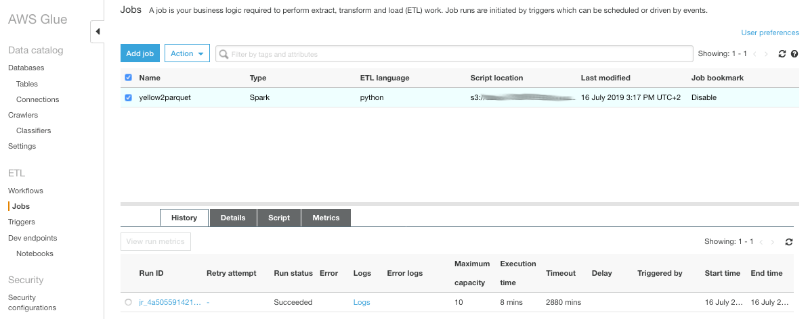
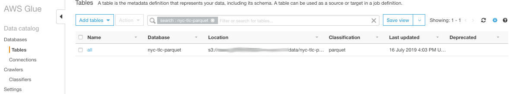
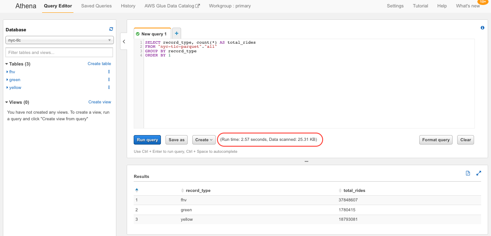
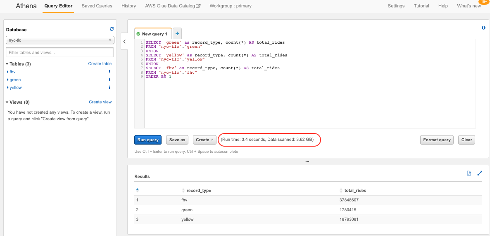

## Data preparation (ETL)

So far, we have just run queries on the raw CSV-formatted data. This is far from optimal both from performance and cost perspectives. Using text formatted data forces the query interpreter to scan entire rows, even when only a few columns are needed. Non-compressed formats make the query engine scan a lot more bytes than it would have done otherwise. More data scanned means worse performance at a higher cost.

To help us in that area, we can leverage columnar formats, such as Parquet and ORC, that also allow for block compression.

In this section we will leverage [AWS Glue](https://aws.amazon.com/glue/) to create ETL jobs that will transform the original CSV-formatted data into [Apache Parquet](https://parquet.apache.org/). In addition to that, we will aggregate the data from the three original tables into one target table only.

1. Navigate back to the [AWS Glue management console](https://console.aws.amazon.com/glue/home). Make sure the AWS Region selector matches the one you have been working with so far.

1. In the navigation pane on the left, click on **Jobs**. Click **Add job**

1. Specify job properties as follows:
	* Job name: `yellow2parquet`
	* IAM role: `DefaultAWSGlueServiceRole`
	* This job runs: *A proposed script generated by AWS Glue*
	* ETL language: *Python*
	* Script file name: `yellow2parquet`
	* S3 path where the script is stored: `s3://<workshop-bucket>/nyc-tlc-scripts`
	* Temporary directory: `s3://<workshop-bucket>/tmp`
	
	Click **Next**
 
	

1. Select the `nyc-tlc.yellow` table as data source. Click **Next**
 
	

1. As data target:
	* Select *Create tables in your data target*
	* Data store: S3
	* Format: Parquet
	* Target path: `s3://<workshop-bucket>/data/nyc-tlc-parquet/all`
	 
	Click **Next**

	
	
1. Now specify how source columns map to target columns. First, get rid of the columns we do not want to be part of the transformed table by clicking the  icon, leaving only the colums below:
	* `vendorid`
	* `tpep_pickup_datetime`
	* `tpep_dropoff_datetime`
	* `trip_distance`
	* `pulocationid`
	* `dolocationid`
	* `total_amount`
	 
	

	Now click over the name of column `tpep_pickup_datetime` and change it to `pickup_datetime`

	
	 
	Click over the type of column `pickup_datetime` and change it to be *TIMESTAMP*

	

	With column `tpep_dropoff_datetime`, change its name to `dropoff_datetime` and the type to *TIMESTAMP*.  
	With column `vendorid` change its type to *STRING*
	
	Click **Next**

1. On the Review page double check your inputs and click **Finish**. That will generate the AWS Glue PySpark script.

	

1. To illustrate how you can customize it, we are going to modify the generated PySpark script to add an extra column. The extra column is named `record_type` of type `string` and will serve as a qualifier that help us differentiate the different taxi rides in the target table. To achieve that we use an [AWS Glue PySpark Map transform](https://docs.aws.amazon.com/glue/latest/dg/aws-glue-api-crawler-pyspark-transforms-map.html).

	Locate the line that starts with `datasource0 = glueContext.create_dynamic_frame.from_catalog`. Right below insert the following code snippet: 
	
	```python
	## @type: Map
	## @args: [f = addFields, transformation_ctx = "map1"]
	## @return: map1
	## @inputs: [frame = datasource0]
	def addFields(rec):
	  rec["record_type"] = "yellow"
	  return rec
	map1 = Map.apply(frame = datasource0, f = addFields, transformation_ctx = "map1")
	```
	
	Now find a block of 5 lines with the first one starting with `## @type: ApplyMapping`. Replace those 5 lines by the following code snippet:
	
	```python
	## @type: ApplyMapping
	## @args: [mapping = [("vendorid", "long", "vendorid", "string"), ("tpep_pickup_datetime", "string", "pickup_datetime", "timestamp"), ("tpep_dropoff_datetime", "string", "dropoff_datetime", "timestamp"), ("trip_distance", "double", "trip_distance", "double"), ("pulocationid", "long", "pulocationid", "long"), ("dolocationid", "long", "dolocationid", "long"), ("total_amount", "double", "total_amount", "double"), ("record_type", "string", "record_type", "string")], transformation_ctx = "applymapping1"]
	## @return: applymapping1
	## @inputs: [frame = map1]
	applymapping1 = ApplyMapping.apply(frame = map1, mappings = [("vendorid", "long", "vendorid", "string"), ("tpep_pickup_datetime", "string", "pickup_datetime", "timestamp"), ("tpep_dropoff_datetime", "string", "dropoff_datetime", "timestamp"), ("trip_distance", "double", "trip_distance", "double"), ("pulocationid", "long", "pulocationid", "long"), ("dolocationid", "long", "dolocationid", "long"), ("total_amount", "double", "total_amount", "double"), ("record_type", "string", "record_type", "string")], transformation_ctx = "applymapping1")
	```

	Click **Generate diagram** to make sure syntax is ok. Verify the ETL diagram changes accordingly.
	
1. Click **Save** and **Run job**. The job is scheduled for execution and it will start running in a few seconds/minutes. When it starts, you can follow its progress on the **Logs** tab. It will take it somewhere close to 15 minutes to finish.

	

1. Wait for the job to finish. Close the script view and verify that the job ended successfully.

	
	
	If it did not, you can access the job output and error logs by clicking on the **Logs** and **Errors logs** links
	
1. Create a new job for the `green` table as follows.

	Job properties:
	
	* Job name: `green2parquet`
	* IAM role: `DefaultAWSGlueServiceRole`
	* This job runs: *A proposed script generated by AWS Glue*
	* ETL language: *Python*
	* Script file name: `green2parquet `
	* S3 path where the script is stored: `s3://<workshop-bucket>/nyc-tlc-scripts`
	* Temporary directory: `s3://<workshop-bucket>/tmp`  
	
	Data source:  
	
	* Table: `nyc-tlc.green`
	
	Data target:
	
	* Select *Create tables in your data target*
	* Data store: S3
	* Format: Parquet
	* Target path: `s3://<workshop-bucket>/data/nyc-tlc-parquet/all`
	 
	Mappings:
	
	* `vendorid`, as *STRING*
	* `lpep_pickup_datetime`, to `pickup_datetime` as *TIMESTAMP*
	* `lpep_dropoff_datetime`, to `dropoff_datetime` as *TIMESTAMP*
	* `trip_distance`
	* `pulocationid`
	* `dolocationid`
	* `total_amount`

	Locate the line that starts with `datasource0 = glueContext.create_dynamic_frame.from_catalog`. Right below insert the following code snippet: 
	
	```python
	## @type: Map
	## @args: [f = addFields, transformation_ctx = "map1"]
	## @return: map1
	## @inputs: [frame = datasource0]
	def addFields(rec):
		rec["record_type"] = "green"
		return rec
	map1 = Map.apply(frame = datasource0, f = addFields, transformation_ctx = "map1")
	```
	
	Now find a block of 5 lines with the first one starting with `## @type: ApplyMapping`. Replace those 5 lines by the following code snippet:

	```python
	## @type: ApplyMapping
	## @args: [mapping = [("vendorid", "long", "vendorid", "string"), ("lpep_pickup_datetime", "string", "pickup_datetime", "timestamp"), ("lpep_dropoff_datetime", "string", "dropoff_datetime", "timestamp"), ("pulocationid", "long", "pulocationid", "long"), ("dolocationid", "long", "dolocationid", "long"), ("total_amount", "double", "total_amount", "double"), ("record_type", "string", "record_type", "string")], transformation_ctx = "applymapping1"]
	## @return: applymapping1
	## @inputs: [frame = map1]
	applymapping1 = ApplyMapping.apply(frame = map1, mappings = [("vendorid", "long", "vendorid", "string"), ("lpep_pickup_datetime", "string", "pickup_datetime", "timestamp"), ("lpep_dropoff_datetime", "string", "dropoff_datetime", "timestamp"), ("pulocationid", "long", "pulocationid", "long"), ("dolocationid", "long", "dolocationid", "long"), ("total_amount", "double", "total_amount", "double"), ("record_type", "string", "record_type", "string")], transformation_ctx = "applymapping1")
	```	
	
	Save and run the job. It will take it somewhere close to 10 minutes to finish.
	
1. Create a third job for the `fhv` table as follows.

	Job properties:
	
	* Job name: `fhv2parquet`
	* IAM role: `DefaultAWSGlueServiceRole`
	* This job runs: *A proposed script generated by AWS Glue*
	* ETL language: *Python*
	* Script file name: `fhv2parquet `
	* S3 path where the script is stored: `s3://<workshop-bucket>/nyc-tlc-scripts`
	* Temporary directory: `s3://<workshop-bucket>/tmp`  
	
	Data source:  
	
	* Table: `nyc-tlc.fhv`
	
	Data target:
	
	* Select *Create tables in your data target*
	* Data store: S3
	* Format: Parquet
	* Target path: `s3://<workshop-bucket>/data/nyc-tlc-parquet/all`
	 
	Mappings:
	
	* `dispatching_base_num`, to `vendorid`
	* `pickup_datetime`, as *TIMESTAMP*
	* `dropoff_datetime`, as *TIMESTAMP*
	* `pulocationid`
	* `dolocationid`

	Locate the line that starts with `datasource0 = glueContext.create_dynamic_frame.from_catalog`. Right below insert the following code snippet: 
		
	```python
	## @type: Map
	## @args: [f = addFields, transformation_ctx = "map1"]
	## @return: map1
	## @inputs: [frame = datasource0]
	def addFields(rec):
		rec["record_type"] = "fhv"
		rec["total_amount"] = 0
		return rec
	map1 = Map.apply(frame = datasource0, f = addFields, transformation_ctx = "map1")
	```
	
	Now find a block of 5 lines with the first one starting with `## @type: ApplyMapping`. Replace those 5 lines by the following code snippet:
			
	```python
	## @type: ApplyMapping
	## @args: [mapping = [("dispatching_base_num", "string", "vendorid", "string"), ("pickup_datetime", "string", "pickup_datetime", "timestamp"), ("dropoff_datetime", "string", "dropoff_datetime", "timestamp"), ("pulocationid", "long", "pulocationid", "long"), ("dolocationid", "long", "dolocationid", "long"), ("total_amount", "double", "total_amount", "double"), ("record_type", "string", "record_type", "string")], transformation_ctx = "applymapping1"]
	## @return: applymapping1
	## @inputs: [frame = map1]
	applymapping1 = ApplyMapping.apply(frame = map1, mappings = [("dispatching_base_num", "string", "vendorid", "string"), ("pickup_datetime", "string", "pickup_datetime", "timestamp"), ("dropoff_datetime", "string", "dropoff_datetime", "timestamp"), ("pulocationid", "long", "pulocationid", "long"), ("dolocationid", "long", "dolocationid", "long"), ("total_amount", "double", "total_amount", "double"), ("record_type", "string", "record_type", "string")], transformation_ctx = "applymapping1")
	```	
	
	Save and run the job. It will take it somewhere close to 10 minutes to finish.

1. Verify you ended up with 3 succeessfully executed jobs

	
	
1. Now that you have a Parquet-formatted object on S3, create a new crawler to catalog the table just created:

	* Name: `nyc-tlc-trip-record-data-parquet` 
	* Data store: S3
	* Crawl data in: *Specified path in my account*
	* Include path: `s3://<workshop-bucket>/data/nyc-tlc-parquet/all`
	* IAM role: `DefaultAWSGlueServiceRole`
	* Frequency: *Run on demand*
	* Add database: `nyc-tlc-parquet`

	Run the crawler and see the new table in the catalog.
	
	
	
13. Explore the Parquet-based table on Amazon Athena. Verify the improvement in both performance and amount of data scanned compared to analogous queries run against the non-cormpressed CSV-based tables.
	
	**Parquet**
	
	```sql
	SELECT record_type, count(*) AS total_rides
	FROM "nyc-tlc-parquet"."all"
	GROUP BY record_type
	```
	

	**CSV**	
	
	```sql
   	SELECT 'green' as record_type, count(*) AS total_rides
   	FROM "nyc-tlc"."green"
   	UNION
   	SELECT 'yellow' as record_type, count(*) AS total_rides
   	FROM "nyc-tlc"."yellow"
   	UNION
   	SELECT 'yellow' as record_type, count(*) AS total_rides
   	FROM "nyc-tlc"."fhv"
	```
	


### Congratulations! You completed the data preparation part

[Back to home page](README.md)

