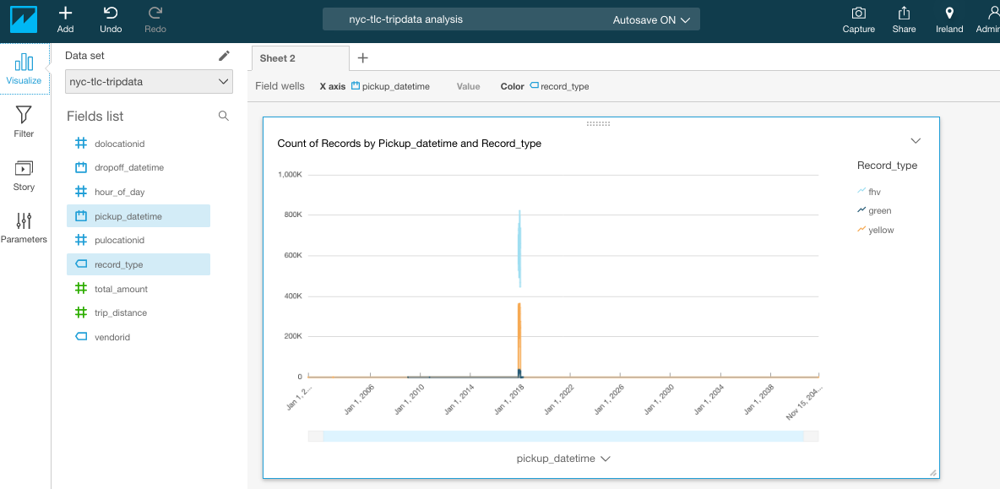
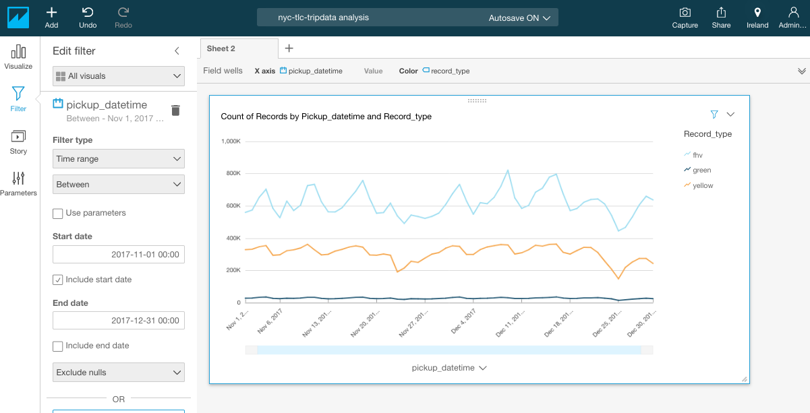

## Data visualization

So far, we have imported a raw dataset into our central data lake on Amazon S3, created a data catalog automatically with AWS Glue, performed data discovery using standard SQL queries with Amazon Athena, transformed the raw CSV-formatted uncompressed data into columnar snappy-compressed Parquet files to optimize queries and reporting. Yet, whithout having to spun up any cluster and paying exactly for what we use: the amount of data stored, the number of queries run, the number of ETL jobs executed.

The last step to complete our serveless analytics journey is now to visualize the data in a way that can be easily consumed by the business. For that we are going to make use of [Amazon QuickSight](https://quicksight.aws/) a fast, cloud-powered business intelligence service that makes it easy to build visualizations, perform ad-hoc analysis, and quickly get business insights from your data.

1. Navigate to the [Amazon QuickSight console](https://quicksight.aws.amazon.com/). If this is the first time you access QuickSight, click *Sign up for QuickSight*. Choose the *Standard* edition and click **Continue**

2. On the *Create your QuickSight account* specify:
	* a globally unique name for your quicksight account
	* an email address for notifications
	* the region that you have been using throught the workshop

3. Scroll down the page and make sure that your QuickSight account has access to S3 by selecting **Amazon S3**.

	

4. Click on the **Choose S3 bucket** link and select your data bucket `<workshop-bucket>`. 

	

	Click **Select buckets** and proceed to provision your QuickSight account and click **Finish**.
	
5. Once your QuickSight account is provisioned you can always refine/change access to resources by clicking the  icon and **Manage QuickSight**

	

6. Go back to the [Amazon QuickSight home](https://quicksight.aws.amazon.com/) and click **Manage data**. Click **New data set** to create a data set. Select **Athena**

	
	
7. Specify a name for the data set, for example, `nyc-tlc-dataset` and click **Create data source**

	

	Select `nyc-tlc-parquet` as database and `all`as table. Click **Select**

	
	
	Select **Directly query your data** and click **Edit/Preview data**

	
	

8. Change the data source name to `nyc-tlc-tripdata`. 

	

9. In the *Fields* section in the left bar, create a new calculated clicking **Add calculated field**. We want a field called `hour_of_day` that we will compute extracting the hour from the `pickup_datetime` source field. Leverage Amazon QuickSight built-in functions for that: `extract('HH',{pickup_datetime})`

	
	
	Click **Create**

10. Create now a visualization by clicking **Save & Visualize**. Add a line chart . From the **Fields list** drag **pickup_datetime** and drop it into the **X axis** box. By default timestamp data types are aggregated by day, but you can adjust it to your preference. From the **Fields list** drag **record_type**, that identifies the type of vehicle, and drop it into the **Color** box.

	
	
	If you see something like the above is because your dataset contains a few outlier records with dates outside the range. Use a filter to get a better visualization. Click on the  icon and create a filter for *pickup_datetime* with the following settings:
	
	* *All visuals*
	* Filter type: *Time range*, *Between*
	* Start date in UTC: `2017-11-01 00:00`
	* End date in UTC: `2017-12-31 23:59`

	Click **Apply**
	

	
	
	Explore the different options you have to customize the chart.

11. Add a second chart by clicking **Add**, **Add visual**

	

12. Add a heat map chart . From the **Fields list** drag **pickup_datetime** and drop it into the **Rows** box. Drop the calculated field **hour\_of\_day** into the **Columns** box.

	
	
	Notice the different pattern beetween work days and weekends and how easily you can tell them appart using the heat map chart.	
	
	
### Congratulations! You completed the data visualization part

[Back to home page](README.md)

[Back to top](#data-visualization)

