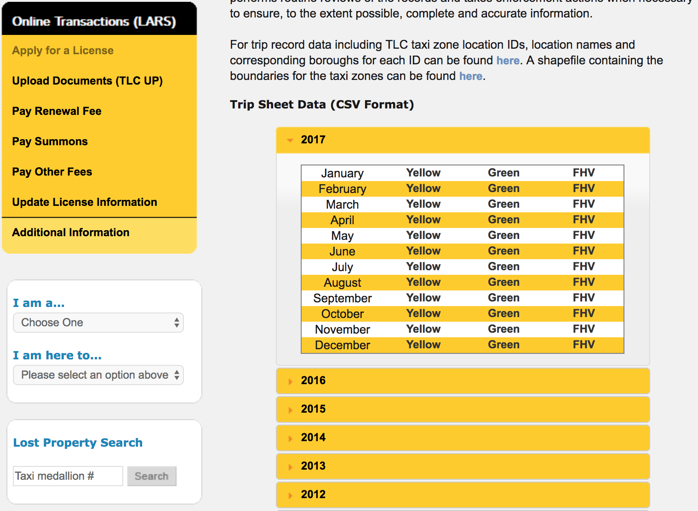

## Serverless Analytics

In this workshop you will learn how to implement big data in a serverless fashion, leveraging [Amazon S3](https://aws.amazon.com/s3/), [AWS Glue](https://aws.amazon.com/glue/), [Amazon Athena](https://aws.amazon.com/athena/) and [Amazon QuickSight](https://aws.amazon.com/quicksight/) to:  

* upload a dataset to your central data lake,
* automate the creation of the data catalog,
* schedule ETL processes that aggregate data from multiple tables and convert them into a compressed columnar format that allows to speed up and reduce the cost of your queries,
* query the data using standard SQL 
* create and share rich web-based visualizations

All without having to manage clusters. Even more, without having to spin up a single instance.

Welcome to the serverless age!

### The dataset

For this workshop we are going to use data made available by the [New York City Taxi and Limousine Commission](http://www.nyc.gov/html/tlc/html/home/home.shtml) (TLC).

Raw CSV-formatted trip record data can be downloaded from the TLC website itself at [www.nyc.gov/html/tlc/html/about/trip\_record\_data.shtml
](http://www.nyc.gov/html/tlc/html/about/trip_record_data.shtml). On this page TLC provides monthly extracts on yellow cabs, boro taxis (green) and for-hire vehicles (FHV).

The yellow and green taxi trip records include fields capturing pick-up and drop-off dates/times, pick-up and drop-off locations, trip distances, itemized fares, rate types, payment types, and driver-reported passenger counts. The FHV trip records include fields capturing the dispatching base license number and the pick-up date, time, and taxi zone location identifier.

You can use data from any month avaiable. In this particular example we are going to use data from November and December 2017.

### Let's get the show on the road

1. [Upload the dataset](01-setup.md)
1. [Create the data catalog with AWS Glue](02-data-catalog.md)
1. [Data discovery with Amazon Athena](03-data-discovery.md)
1. [ETL with AWS Glue](04-etl.md)
1. [Create rich web-based visualizations with Amazon QuickSight](05-visualization.md)

